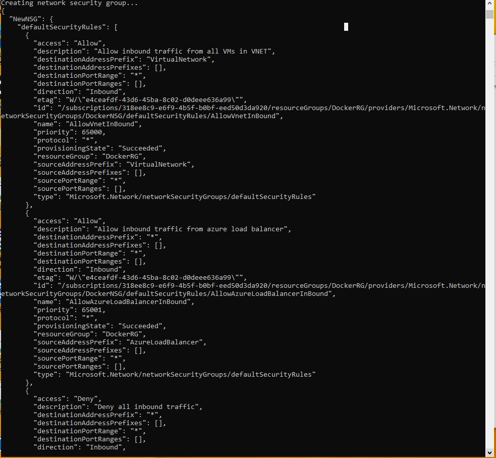

# Azure Auto Docker Deployment

## How to Use
1. Login to Azure CLI:
   ```bash
   az login
   ```

2. Make the script executable:
   ```bash
   chmod +x deploy_server.sh
   ```

3. Run the script:
   ```bash
   ./deploy_server.sh
   ```

4. SSH into the server and install Docker:
   ```bash
   sudo apt update
   sudo apt install docker.io -y
   sudo systemctl start docker
   sudo systemctl enable docker
   ```

5. Run Docker containers:
   ```bash
   docker run hello-world
   docker run -d -p 80:80 nginx
   ```

## Screenshots

| Step                         | Screenshot |
|------------------------------|------------|
| Deployment Script Run Part 1 |  |
| Deployment Script Run Part 2 |  |
| Deployment Script Run Part 3 |  |
| Deployment Script Run Part 4 |  |
| Deployment Script Run Part 5 |  |
| Docker Hello World           |  |
| Docker Nginx Running         |  |


## Future Improvements
- Docker Compose setup for multi-container applications
- Automatic security updates on deployed server

## Author
- Anthony Solis - [GitHub Profile](https://github.com/ASolis2)
